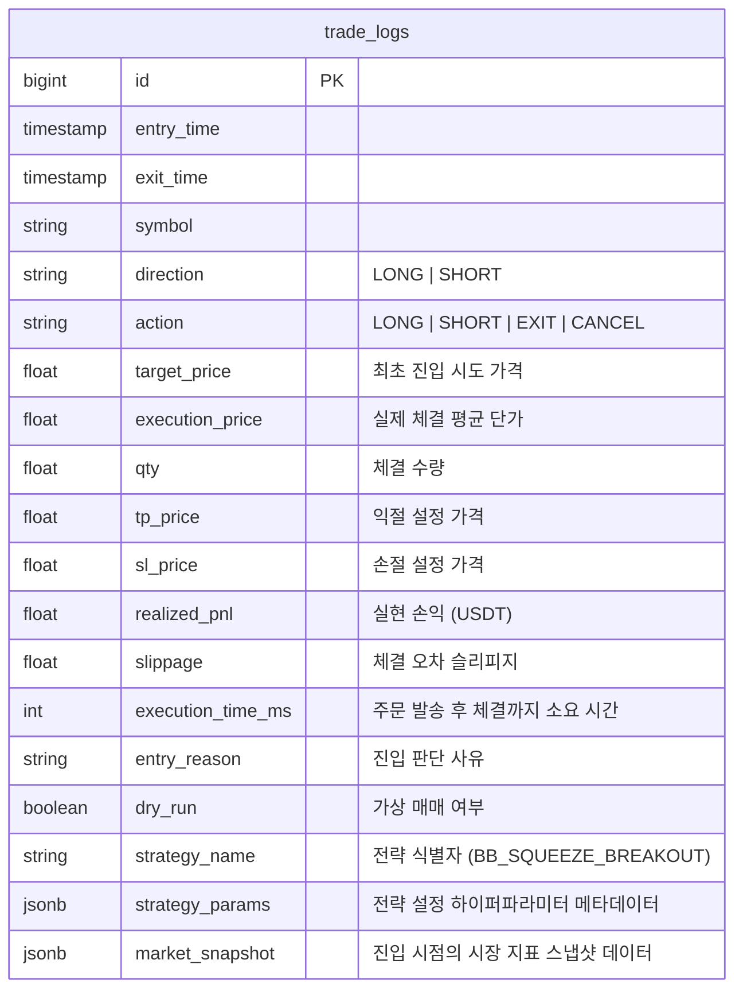
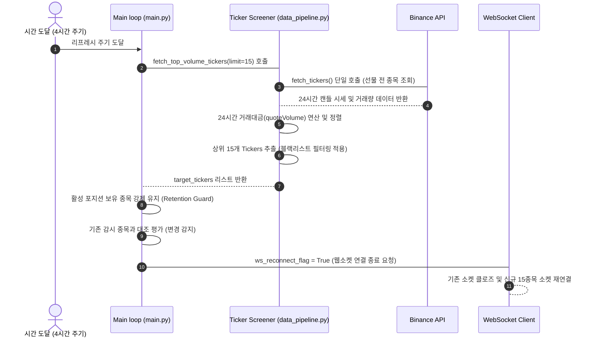
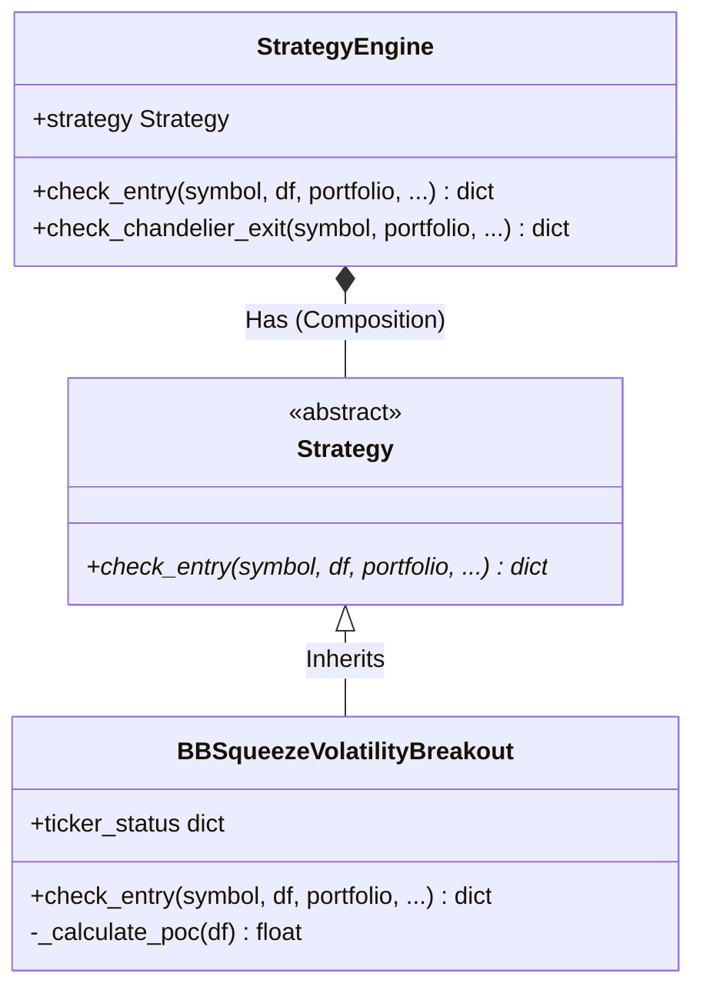
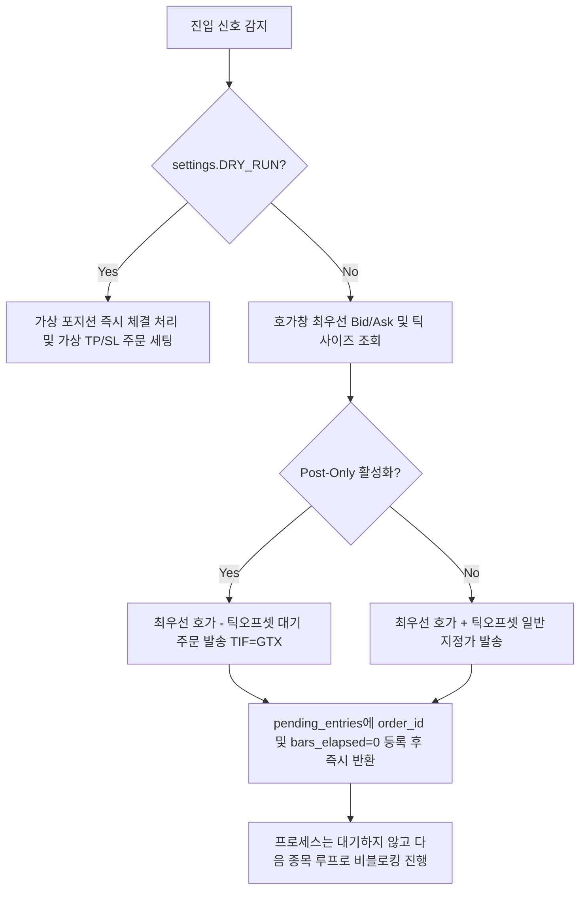

# 🏛️ Production Architecture & Quantitative Blueprint — Binance Bot V18.7

본 설계도는 바이낸스 롱/숏 퀀트 봇(`binance_bot`)의 머신러닝 스코어링 방식을 폐기하고, 볼린저 밴드 스퀴즈 돌파 전략 기반의 **독립적인 전략 패턴** 전환 및 바이낸스 API 제약 조건을 극복하기 위한 **비블로킹 지정가 진입·3봉 미체결 타임아웃 취소·4시간 주기 거래대금 스크리너·Supabase DB 개편**과 V18.7에서 추가된 **100봉 Percentile Squeeze·실시간 펀딩비 및 볼륨 프로파일 POC 저항 필터 결합**을 정의하는 시스템 아키텍처 청사진입니다.

---

## 1. 데이터베이스 스키마 및 매매 로그 단일화 (Supabase Trade Log DB Schema)

시스템 I/O 부하 및 Supabase 스토리지 요금을 절약하기 위해 대량의 캔들 봉 데이터(`market_data_1m`)와 실시간 상태 스냅샷(`market_snapshots`) 테이블을 완전히 폐기하고, 오직 전략별 매매 이력을 추적할 수 있는 `trade_logs` 테이블 하나로 단일화 및 고도화하였습니다.

### 1.1 데이터 모델 및 관계도 (ERD Conceptual Diagram)

### 1.2 DB 개편 현황

| 테이블 | 용도 | 상태 | 비고 |
| :--- | :--- | :---: | :--- |
| `trade_logs` | 매매 체결, 청산 및 대기 취소(CANCEL) 이력 저장 | ✅ **개편 완료** | `strategy_name`, `strategy_params`, `market_snapshot` JSONB 필드를 탑재하여 벌크 테이블 삭제 후에도 완벽한 사후 트레이딩 백테스팅 분석 가능 |
| `market_snapshots` | 기존 HFT 실시간 시장 데이터 적재 | ❌ **폐기 완료** | I/O 병목 및 Supabase 저장 공간 낭비 방지를 위해 전면 제거 |
| `market_data_1m` | 기존 1분봉 캔들 데이터 적재 | ❌ **폐기 완료** | 지표 연산은 REST API 웜업 및 WebSocket 실시간 인메모리 관리로 완전 일원화 |

---

## 2. 동적 타겟 종목 선정 아키텍처 (Ticker Screener Module)

바이낸스 선물 시장(USDT-M Futures)의 전 종목을 매번 폴링하여 지표를 연산하는 것은 API Rate Limit(가중치 초과) 및 IP 차단 위험을 유발합니다. 또한 거래대금이 없는 잡코인의 슬리피지(Slippage)를 원천 차단하기 위해 **4시간 주기 24시간 거래대금 상위 15개 종목 자동 선정 스크러너**를 도입하였습니다.

### 2.1 스크리닝 및 WebSocket 재연결 시퀀스

---

## 3. 독립적 전략 패턴 및 볼린저 밴드 스퀴즈 돌파 전략 (Strategy Pattern & V18.7)

기존 머신러닝 스코어링 방식을 완전히 걷어내고, 전략적 유연성과 모듈화를 위해 **전략 패턴(Strategy Pattern)**으로 전환하였습니다.

### 3.1 클래스 구조 및 전략 컨텍스트 관계도 (UML Diagram)

### 3.2 BBSqueezeVolatilityBreakout 핵심 메커니즘
1. **정석적 수축 상태 (Percentile Squeeze Entry)**:
   - 과거 100봉 내의 밴드폭(Bandwidth) 분포에서 현재 밴드폭의 백분위수 등급(Percentile)을 산출합니다.
   - 백분위수가 **하위 20% 미만**으로 좁아졌을 때 (`Percentile < 20.0`) 수축 상태로 판정하고 `in_squeeze = True` 및 `squeeze_bars = 1` 상태로 진입합니다.
2. **돌파 신호 (Breakout Trigger)**:
   - Squeeze 진입 후 최대 **12봉 내**에 현재 종가가 볼린저 밴드 상단(또는 하단)을 돌파하고, 20봉 평균 거래량 대비 **2배 이상의 대량 거래량**이 동반될 경우 지정가 진입 신호(LONG/SHORT)를 생성합니다.
   - 12봉 동안 돌파가 일어나지 않으면 Squeeze 상태는 자동으로 **만료(Timeout)** 처리되어 리셋됩니다.
3. **실전 모멘텀 및 매물대(POC) 필터 (AND 결합)**:
   - **실시간 펀딩비 필터**: 실시간 펀딩비가 극단적인 양수(`> 0.1%`)일 때 롱 진입 차단, 극단적인 음수(`< -0.05%`)일 때 숏 진입 차단.
   - **볼륨 프로파일 POC 필터**: 최근 200봉 기준 최대 매물대(POC)를 계산한 후 종가 바로 위(`Price ~ Price * 1.02`)에 POC 저항이 있으면 LONG 차단, 종가 바로 아래(`Price * 0.98 ~ Price`)에 POC 지지가 있으면 SHORT 차단.
4. **샹들리에 익절/손절선 (Chandelier Exit Safety Net)**:
   - `StrategyEngine.check_chandelier_exit`을 통해 매 캔들 주기마다 보유 포지션의 트레일링 스탑 가격을 최신 ATR의 3배수로 업데이트하여 안전하게 추적 청산합니다.

---

## 4. 비블로킹 지정가 진입 및 3봉 타임아웃 취소 제어 (Execution Engine)

테이커 수수료(Taker Fee)를 줄이고 메이커(Maker) 주문 체결율을 극대화하기 위해, 기존의 블로킹 방식 호가 추격(Chasing) 루프를 완전 폐기하고 **비블로킹 지정가 주문 제어 레이어**를 설계하였습니다.

### 4.1 비블로킹 주문 처리 흐름 (Non-blocking Flowchart)

### 4.2 3봉 미체결 타임아웃 및 부분 체결 감시 (`state_machine_loop`)
- **경과 봉 수 카운팅**: `process_closed_kline` 은 3분봉 캔들이 마감될 때마다 `pending_entries` 에 들어있는 모든 심볼의 `bars_elapsed`를 `1`씩 증가시킵니다.
- **상태 검증 및 3봉 타임아웃**:
  - `check_pending_orders_state()` 가 대기 주문을 감시하여 상태가 `closed`(체결 완료)이면 포지션을 정식 활성화하고 실제 체결 평단을 기반으로 익절/손절(TP/SL) 주문을 연동 발주합니다.
  - 3봉이 지날 동안 미체결(`bars_elapsed >= 3`) 상태이면 즉시 `cancel_order`를 거래소에 호출합니다.
  - **부분 체결 처리**: 취소 후 최종 체결 수량(filled)이 존재한다면, 부분 체결된 수량에 한해 활성 포지션으로 강제 편입하고 그 비율에 비례해 부분 TP/SL 주문을 발주하여 잔여 포지션 방치 리스크를 소멸시킵니다.

---

## 5. 시스템 복원력 및 무중단 안정성 가이드 (Resilience & Exception Reporting)

프로덕션 레벨의 신뢰성을 담보하기 위해 네트워크 단절, 바이낸스 점검, Supabase API 지연 등 다양한 네트워크 예외 상황을 격리하여 대처합니다.

- **원격 예외 리포팅**: `state_machine_loop`, `target_refresh_loop`, `websocket_loop` 등 모든 코어 백그라운드 태스크의 최상위 예외 블록에 `try-except`를 밀착시켜 예외 발생 시 상세 Traceback과 오류 내용을 텔레그램 메신저(`notifier.send_message`)로 즉시 리포트하고 다음 주기로 넘어갑니다.
- **자가 치유 동기화**: `check_state_mismatch` 및 `sync_state_from_exchange` 는 봇 재시작 또는 비정상 종료 후 복구 시 DB의 매매 로그와 거래소 포지션을 대조하여 누락된 TP/SL 주문을 자동 생성하고 메모리를 최신 상태로 유지합니다.
